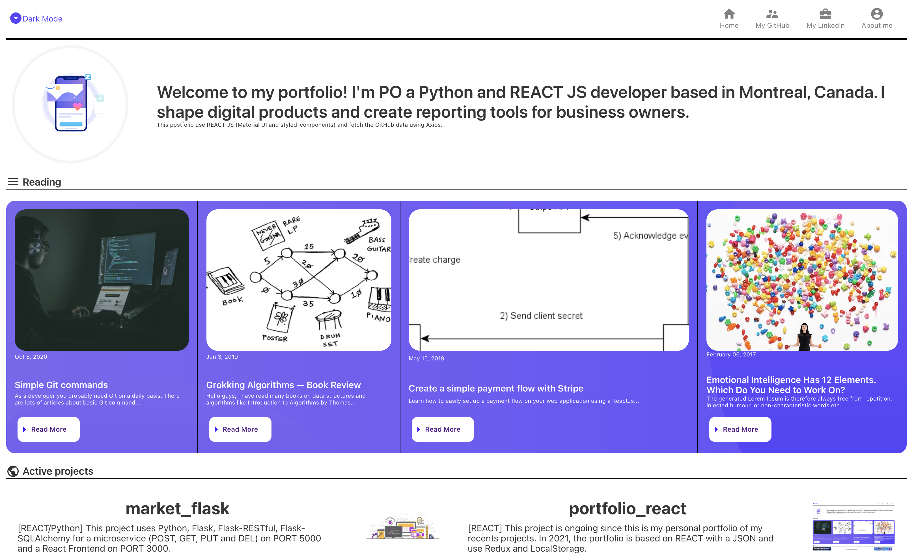

[![Issues][issues-shield]][issues-url] <br />

<!-- PROJECT LOGO -->
<br />
<p align="center">
  <h3 align="center">Portfolio (articles and projects with REACT and Firebase)</h3>

  <p align="center">
    <a href="https://portfolio-a541e.web.app/">View Live Demo</a>
  </p>
</p>

<!-- ABOUT THE PROJECT -->

## :hear_no_evil: About The Project

The goal of this project is to build a portfolio to present recent projects with Firebase and React. The minimalist and monochrome is the main idea for the UX design. This project explores API connection to a Github repository, Wrapper, Jumbotron and Redux to animate the dark mode.



### :airplane: Ressources

> Software: React 17, Docker, Kubernetes

<!-- GETTING STARTED -->

## :rocket: Demo & Repository

Demo: https://portfolio-a541e.web.app/

Github: https://github.com/poboisvert/PortfolioReact

## :vulcan_salute: What do I need to change?

> Change with you favorite URL in the top menu to fetch your repository

```
client/src/components/Header/Header.js
```

> Kindly adjust the file to your repository and projects to highlight.

```
client/src/api/GithubAPI.js
```

> Also edit the articles that you feel are important to share

```
client/src/components/Articles/FetchArticle.js
```

### :phone: Prerequisites

This is an example of how to list things you need to use the software and how to install them.

- npm
  ```sh
  npm install npm@latest -g
  ```

### :floppy_disk: Installation

1. Clone the repo
   ```sh
   git clone https://github.com/poboisvert/portfolio_react
   ```
2. Install NPM packages
   ```
   cd client && npm install
   ```
3. Run Node
   ```
   npm start
   ```

### :whale: Build a Docker image

> docker build -t pob944/portfolio .

> docker run -p 3001:3000 pob944/portfolio

> docker push pob944/portfolio

<!-- CONTACT -->

## Contact

[![LinkedIn][linkedin-shield]][linkedin-url]

<!-- MARKDOWN LINKS & IMAGES -->
<!-- https://www.markdownguide.org/basic-syntax/#reference-style-links -->

[issues-shield]: https://img.shields.io/aur/last-modified/portfolio
[issues-url]: https://github.com/poboisvert/portfolio_app_react/issues
[license-shield]: https://img.shields.io/github/license/github_username/repo.svg?style=for-the-badge
[license-url]: https://github.com/github_username/repo/blob/master/LICENSE.txt
[linkedin-shield]: https://img.shields.io/badge/-LinkedIn-black.svg?style=for-the-badge&logo=linkedin&colorB=555
[linkedin-url]: https://www.linkedin.com/in/pierre-olivier-boisvert-a83b5796/
[product-screenshot]: preview.png
